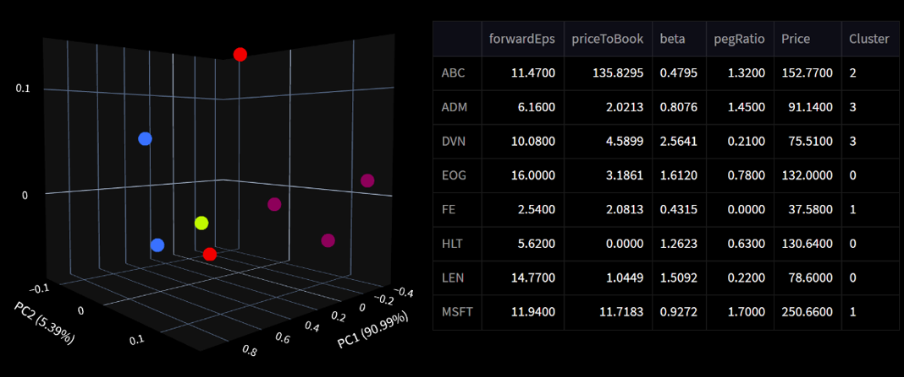

# 👋 Jackson Li
 As a Corporate Finance Graduate from the University of Adelaide, I have a passion in gathering and analysing data to identify investment opportunities. I have a background in financial analysis and i'm constantly developing my data analytics skills.

## 🤹 Skills
* Proficient in SQL and Python for data extraction, wrangling, cleaning, and analysis
* Experience with data visualisation and dashboards using Matplotlib and PowerBI
* Experience in financial portfolio risk and analysis
* Basic understanding of ETL, warehousing, Bigquery, Google Cloud

## 📖 Projects and case studies
* VSCode / Jupyter Notebook / BigQuery / SQL / Python / Pandas / Numpy / matplotlib / SciPy / PowerBI

### **[Ecommerce Sales Analytics Dashboard](thelook_ecommerce_dashboard/project1.ipynb)**
Analysed sales data from BigQuery's public dataset "thelook_ecommerce" using SQL, Python, PowerBI to uncover insights. Build a dashboard for marketing team to identify profit streams to make data-driven decisions to improve their sales and marketing strategies.

### **[Stock Options Dashboard for Australian eChallenge](https://buttersaltpepper-finapp-app-cfhlmv.streamlit.app/)**

: My pitch for the 2022 eChallenge was a dashboard to track US stock options greek exposures and cluster stocks for portfolio diversification, providing valuable insights for risk management.

**[Housing Price Exploratory Data Analysis](Python_HousingPriceEDA/EDA_Housing_Price.ipynb)**: Used Python for univariate and bivariate statistics to study the relationship between the features and housing prices. Used stepwise backward selection to determine which variables were the most influential to guide further analysis.

**[Hedging a Gold Stock Portfolio with Futures (pdf)](Python_Finance/HedgingMarketRisk.pdf)**: Python was used to conduct investment data analysis and calculate the beta hedge ratio using statsmodels, and visualise findings using matplotlib

**[Relationship between CO2 and World Happiness Score](R_co2_vs_happiness/happiness_vs_co2.md)**: Aimed to understand the factors that contribute to happiness in countries and investigated the potential impact of CO2 use on population happiness. The analysis was performed using R and hypothesis tests were applied to draw the connections between CO2 use and happier countries. 

## 📖 Currently Learning
Using data from [StockX](https://stockx.com/), the stock market for sneakers,  I am currently learning ETL pipelines, data warehousing, and Google Cloud. 

## 🔗[LinkedIn](https://www.linkedin.com/in/jackson-li-/). 
